# About

The ideia is to construct a microservice capable of:

- Process order with RabbitMQ


- Create an API REST that allows us to consult:
  - The value of an order;
  - The quantity of orders by client;
  - A list of orders made by a client.


- The API has to be Restfull;
- We can use (Java, Javascript, .Net, etc);
- Any structure of storage (MongoDB, PostgreSQL, MySQL, etc).

[Notion Bruno Grana](https://brunograna.notion.site/Desafio-Backend-BTG-Pactual-Build-Run-3f48048e3e594fbea580c006eac6ff08)

[Github BTG Challenge](https://github.com/buildrun-tech/buildrun-desafio-backend-btg-pactual/blob/main/problem.md)

We are going to use **MongoDB**!

# Technical requirements

This ⬇️ is an example of a message that's going to be consumed by the RabbitMQ queue.

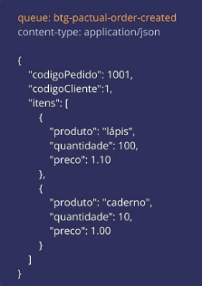

With this message, we have to structure how the data modeling will be.

❗❗Remember
-

- We have to inform the total value of an order;
- The quantity by client;
- A list of orders by client.

# What is RabbitMQ?

It's a system that's based in queue that implements the AMQP protocol (Advanced Message Queuing Protocol). It's used to
allow asynchronous communication between two different components from a system (or between different systems).

Basically it's just like a "mail", where messages are sent to queues and can be consumed by one or more people.

## Concepts

### 1 - Messages

The data that you wish to transmit. It can be a text, JSON, binary ou any format of your choice.

### 2 - Producer

It's the application that sent the messages to a queue in RabbitMQ.

### 3 - Consumer

The application consumes the messages of a queue.

### 4 - Exchange

Responsible for receiving messages from producers, directing them to the proper queues (it use some routing rules).

### 5 - Queue

Where the messages are stored until are consumed. A queue can be consumed by one or many consumers.

### 6 - Binding

Connection between a **exchange** and one **queue**, it defines how the messages are routed.

## How does it work?

### 1

The producer sends a message to an exchange.

### 2

The exchange directs the message to one or more queues (it depends on the config: outing key, type of exchange).

### 3

The consumer reads the message (that are in the queue).

## Types of exchange

### Direct exchange

Messages are rooted to the queues using an exact **routing key**.

### Fanout exchange

Messages are sent to all the queues that are linked to the exchange, they don't use the **routing key**.

### Topic exchange

Messages are rooted using patterns or jokers (curinga) in the **routing key**.

### Headers Exchange

Routing is done based on message headers.

## When to use it

### Service decoupling (desacoplamento)

Components can be independent and change messages without the need to use direct communication.

### Asynchronous processing

Messages can be queued and processed in the background, increasing system performance.

### Communication between different systems

Allow that systems that are written in different languages or on different platforms to communicate. 

### Load distribution

Multiple consumers can process the messages from the same queue, dividing the workload.

# Configuring RabbitMQ and MongoDB with Docker

We'll create a package named ``local`` on the router. Inside, we'll create an ``docker-compose.yml``.

## DockerCompose

Here, we'll define all the services that we need inside our application.

The image of the ``rabbitmq`` service will be: "rabbitmq:3.13-management". This version has a painel that we will manage
everything that happens inside our RabbitMQ.

We'll have two ports:

- 15672:15672: where the painel will be;
- 5672:5672: where application will connect.

```dockerfile
services:
  mongodb:
    image: mongo
    ports:
      - 27017:27017
    environment:
      - MONGO_INITDB_ROOT_USERNAME=admin
      - MONGO_INITDB_ROOT_PASSWORD=123

  rabbitmq:
    image: rabbitmq:3.13-management
    ports:
      - 15672:15672
      - 5672:5672
```

> cd local
> docker compose up

To test the MongoDB, we'll open the MongoDB Compass.

Set up a new connection: ``mongodb://localhost:27017``.

In "Advanced Connection Options" go to "Authentication" > username/password will be the same stuff from the file above.

You can access the RabbitMQ dashboard in: ``localhost:15672``. Username: guest / password: guest

# Configuring Spring Boot and MongoDB

We'll go to the resource package > application.properties.

```properties

# autenticação na base de administrador
spring.data.mongodb.authentication-database=admin

# fará a criação dos indices de forma automática
spring.data.mongodb.auto-index-creation=true

spring.data.mongodb.host=localhost
spring.data.mongodb.port=27017

# qualquer nome, o spring vai criar ao subir a aplicação
spring.data.mongodb.database=btgpactualdb

# mesma coisa do docker-compose
spring.data.mongodb.username=admin
spring.data.mongodb.password=
```

# Configuring RabbitMQ queue

Create a ``config`` package and a class ``RabbitMqConfig``.

```java
@Configuration
public class RabbitMqConfig {
    
    // This is the queue that we want to consume
    public static final String ORDER_CREATED_QUEUE = "btg-pactual-order-created";
    
    //insert the method to convert the JSON
  
    //insert the method to create the queue
}
```

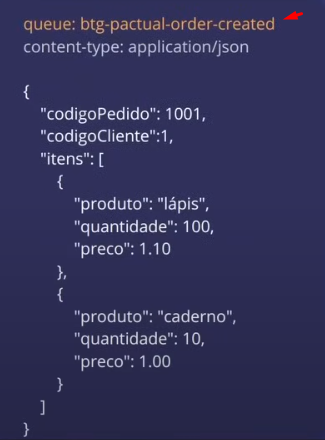

# Features

- [ ] [Map the entities (Order, OrderItem)](#entities)
- [ ] [Create the RabbitMQ queue listener](#creating-rabbitmq-queue-listener)
- [ ] [Create the save implementation (saving the order on MongoDB)](#create-the-save-implementation-saving-order-on-mongodb)
- [ ] [Test the flow (rabbitmq -> spring -> mongodb)](#testing-the-flow-rabbitmq---spring---mongodb)

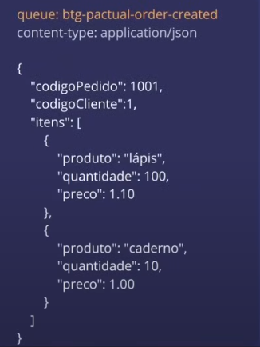

This ⬆️ is a "queue contract". The json object has 2 entities:

1. Order - codigoPedido, codigoPendente, itens (uma lista)
2. OrderItems - A list of itens (that goes inside the Order)

# Functionalities

- [ ] [Endpoints]()
  - [ ] [Total orders by client]()
  - [ ] [Total value of an order]()
  - [ ] [Order quantity by client]()

## Important stuff for the entities

❗Eventually, we are going to calculate the total value of an order, the quantity of orders by client and the list of
the orders by client.

❗Remember: MongoDB uses @Document for entities and @MongoId for Ids!

And also, since we are going to do a lot of queries searching for a specific client, we can use 
``@Indexed(name="customer_id_index")``. Everytime we make a search on the database, it'll be faster.

MongoDB stores BigDecimal as a String, to save with numeric value we can use ``@Field(targetType = FieldType.DECIMAL128``.

## Entities

### Order

```java
```

### OrderItem

```java
```

## Creating RabbitMQ queue listener

Create a package ``listener`` and a class ``OrderCreatedListener``, this class will be a @Component.

This class will be responsible for consuming our queue.

It'll be a public method (void) and we can pass the @RabbitListener! Inside of it, we pass the queue name.

After we consume this queue from RabbitMQ, we have a specific contract to use, it's an interface called "Message" (from
Spring Messaging). 

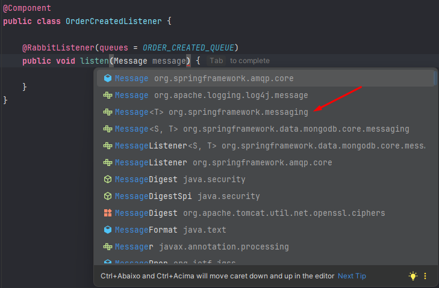

Inside this contract, we'll use a Generics. In this case, the payload or the header of the message that we are going to consume.

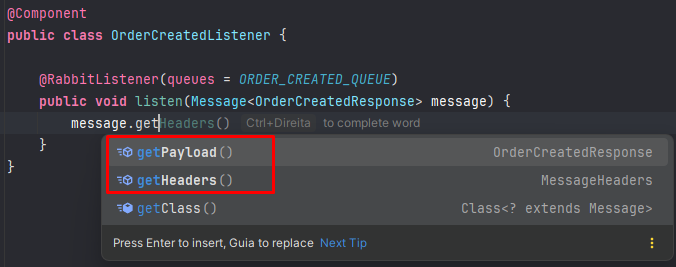

Thus, we need to create a [DTO](#dto).

This DTO will have everything that is returned in that json object (codigoPedido, codigoClient, Itens).

We also have to create a DTO for the list of itens :).

### DTOs

#### OrderCreatedResponse

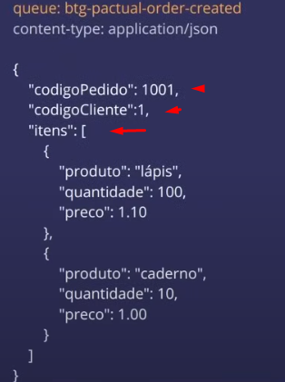

```java
public record OrderCreatedResponse(Long codigoPedido,
                                   Long codigoCliente,
                                   List<OrderItemDto> itens) {
}
```

#### OrderItemDto

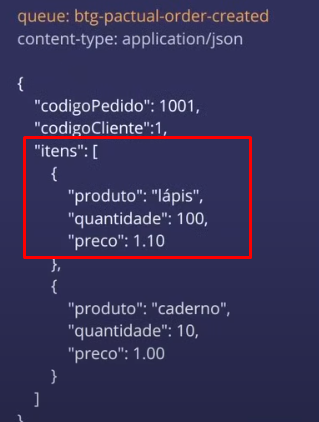

```java
public record OrderItemDto(String produto,
                           Integer quantidade,
                           BigDecimal preco) {
}
```

### Inside the method

Since we are using this Message interface, we can have access to the payload and the headers (who came from the queue):

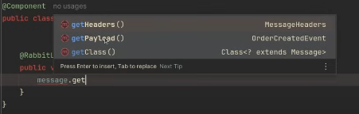

The message by default will be a JSON object, we need to define a JSON converter.

We'll create a bean inside the RabbitMqConfig, responsible to make these payloads conversions, using jackson.

And we'll also create the method to initiate the queue.

#### RabbitMqConfigFinal

```java
@Configuration
public class RabbitMqConfig {

  public static final String ORDER_CREATED_QUEUE = "btg-pactual-order-created";


  //convertindo from JSON to Java
  @Bean
  public Jackson2JsonMessageConverter jackson2JsonMessageConverter() {
    return new Jackson2JsonMessageConverter();
  }


  //creating the queue
  @Bean
  public Declarable orderCreatedQueue() {
    return new Queue(ORDER_CREATED_QUEUE);
  }
}
```

To check the created queue go to: ``localhost:15672/queues``.

Queue created:

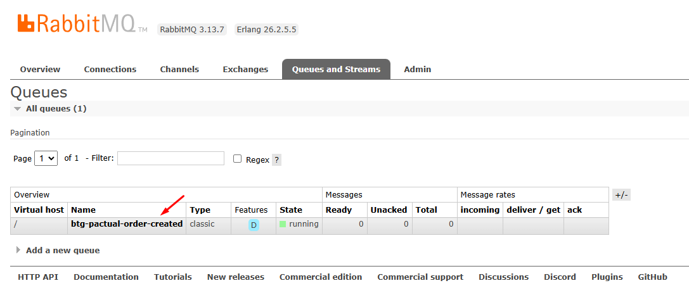

To know if our application is consuming the queue properly, we have to publish a message.

Queues and streams > scroll down > publish message > 

**Headers**: we are not going to use this time

**Payload**: we'll use the json object from the challenge itself:

```json
   {
       "codigoPedido": 1001,
       "codigoCliente":1,
       "itens": [
           {
               "produto": "lápis",
               "quantidade": 100,
               "preco": 1.10
           },
           {
               "produto": "caderno",
               "quantidade": 10,
               "preco": 1.00
           }
       ]
   }
```

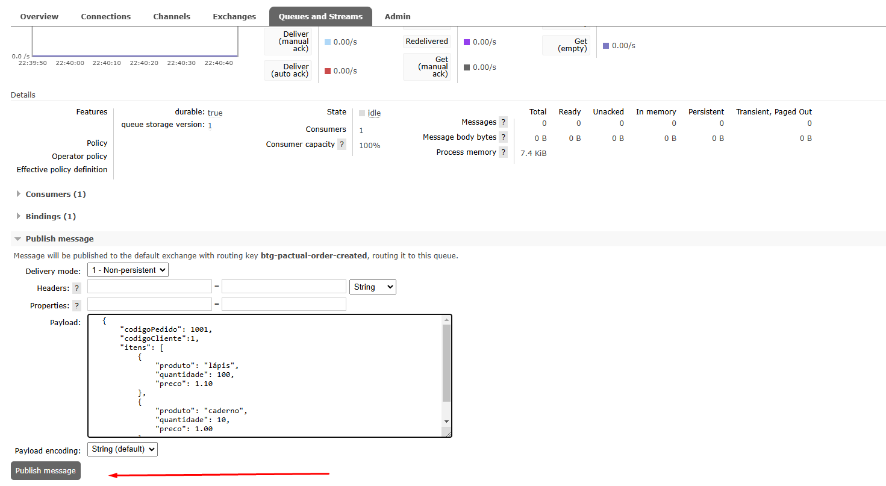

As soon as we published it, we can check the log on the application (if we inserted the Logger).


## Create the save implementation (Saving Order on MongoDB)

Now we'll get the message from the queue and save it on the database.

### OrderRepository

Extends from MongoRepository.

```java
@Repository
public interface OrderRepository extends MongoRepository<Order, Long> {}
```

### OrderService

We'll receive the OrderCreatedEvent and convert to an entity.

The first thing, we are going to inject the OrderRepository with the constructor.

The main method (save), will return void and will have a OrderCreatedResponse (the entire JSON object) as a parameter.

We can use streams to set the items and calcule the total value of the order and after, create a method for it.

```java
@Service
public class OrderService {

    private final OrderRepository orderRepository;

    public OrderService(OrderRepository orderRepository) {
        this.orderRepository = orderRepository;
    }

    private static OrderItem getOrderItems(OrderItemDto item) {
        return new OrderItem(
                item.produto(),
                item.quantidade(),
                item.preco()
        );
    }

    public void save(OrderCreatedResponse event) {
        Order order = new Order();
        order.setOrderId(event.codigoPedido());
        order.setClientId(event.codigoCliente());

        order.setTotal(getTotal(event));


        order.setOrderItems(
                event.itens()
                        .stream()
                        .map(OrderService::getOrderItems)
                .toList());

        orderRepository.save(order);
    }

    private BigDecimal getTotal(OrderCreatedResponse event) {
        return event.itens()
                .stream()
                .map(i -> i.preco().multiply(BigDecimal.valueOf(i.quantidade())))
                .reduce(BigDecimal::add)
                //caso não tenha nada retorna um zero
                .orElse(BigDecimal.ZERO);
    }
}

```

After finishing the service, we have to join te OrderService with the listener.

## Testing the flow (rabbitmq -> spring -> mongodb)

Go to the Listener class.

Import the OrderService, inject on the constructor.

Inside the listen method, use the ``.save()`` inserting the payload (the message itself).

```java
@Component
public class OrderCreatedListener {

    private final Logger logger = LoggerFactory.getLogger(OrderCreatedListener.class);

    private final OrderService orderService;

    public OrderCreatedListener(OrderService orderService) {
        this.orderService = orderService;
    }

    @RabbitListener(queues = ORDER_CREATED_QUEUE)
    public void listen(Message<OrderCreatedResponse> message) {
        logger.info("Message consumed: {}", message);

        orderService.save(message.getPayload());
    }
}
```

After that, we can run the application and publish the message on RabbitMQ.

Checking the MongoDB Compass, the register should be in the database.

# Summary

We created the entities, the attributes where based on the object that we were going to publish on the RabbitMQ.

```json
{
  "codigoPedido": 1001,
  "codigoCliente":1,
  "itens": [
    {
      "produto": "lápis",
      "quantidade": 100,
      "preco": 1.10
    },
    {
      "produto": "caderno",
      "quantidade": 10,
      "preco": 1.00
    }
  ]
}
```

For the application be able to "listen" everything that's happening on RabbitMQ, we have to create a class responsible
for that.

This class will have a method that's going to use an interface (Message) that will be able to access the header and the 
payload.

This interface uses Generics, so we have to use an DTO inside of it to get everything.

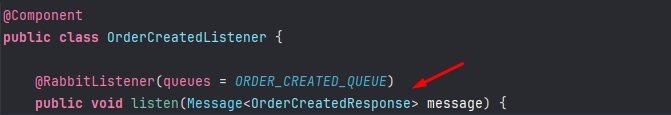

Emphasizing that, this DTO is basically the JSON object. So, inside of it, it's essential to have a list of OrderItem,
just like the Order entity.

By default, this message is a JSON object so we need to convert to Java. Also, we need to initialize the queue as well,
[check it.](#rabbitmqconfigfinal)

Now it's time to create the service, to save the message on the database. Check everything [here.](#orderservice)

# Endpoints

We have to return: 

The list of orders, the total value of an order and the quantity of orders by a certain client.

We'll create an DTO, named "ApiResponse". This DTO will have a generics type ``<T>``, and will receive a ``List<T> data`` 
and since we are working with pagination, we'll insert another DTO named Pagination, responsible for the pageable data.

# List of orders, total value of an order, total orders per client

## ApiResponse (Inside the ResponseEntity)

```java
public record ApiResponse<T>(List<?> data,
                             PaginationDTO pagination) {}
```

## PaginationDTO 

Will have the elements of the pageable. (page, pageSize, totalElements, totalPages)

```java
public record PaginationDTO(Integer page,
                            Integer pageSize,
                            Integer totalElements,
                            Integer totalPages) {
}
```

## Controller

Okay, in the method we are going to return a ResponseEntity, using the Record with generics, ``ResponseEntity<ApiResponse<>>``.

And we're going to insert inside the record with generics, the response itself, that's going to be shown on Postman.

orderId, clientId and the total value of the order.

```java
public record OrderResponse(Long orderId,
                            Long clientId,
                            BigDecimal total) {}
```

We create now a ``Pagerequest``, receiving the page and the pageSize.

We can now, create a variable named "body", that's going to call the service, passing the customerId and the pagerequest.

```java

    @GetMapping(value = "/{id}")
    public ResponseEntity<ApiResponse<OrderResponse>> findAllOrdersByClientId(@RequestParam(name = "page", defaultValue = "0") Integer page,
                                                                            @RequestParam(name = "pageSize", defaultValue = "10") Integer pageSize,
                                                                            @PathVariable Long id) {
        PageRequest pageRequest = PageRequest.of(page, pageSize);

        var body = orderService.findAllOrdersByClientId(id, pageRequest);

        return ResponseEntity.ok(null);
    }
```

## Service

Our method will return a ``Page<OrderResponse>``, receiving the customerId and the pagerequest.

We can create a variable named orders, and use repository to make a custom search.

Since the return is going to be a ``Page<Order>``, we can use the ``.map`` to convert into OrderResponse.

To do that, we can make a static method in our DTO:

```java
public record OrderResponse(Long orderId,
                            Long clientId,
                            BigDecimal total) {

    public static OrderResponse fromEntity(Order order) {
        return new OrderResponse(
                order.getOrderId(),
                order.getClientId(),
                order.getTotal()
        );
    }
}
```

```java
public Page<OrderResponse> findAllOrdersByClientId(Long id, PageRequest pageRequest) {
    var orders = orderRepository.findAllByCustomerId(id, pageRequest);

    return orders.map(OrderResponse::fromEntity);
}
```

## Controller (Final)

Now, we just have to fix what's going to be returned on the response entity.

Inside the ``.ok()`` we can return creating our ``ApiResponse<>()``. Inside, we can return our list (first parameter
of the ApiResponse).

To get the list, we can use the variable ``.getContent()``. And finally, we create a PaginationResponse!

We have two options, insert each attribute inside the constructor, or create a converter just like we did in the service
layer.

```java
public record PaginationDTO(Integer page,
                            Integer pageSize,
                            Long totalElements,
                            Integer totalPages) {

    public static PaginationDTO fromPage(Page<?> request) {
        return new PaginationDTO(
                request.getNumber(),
                request.getSize(),
                request.getTotalElements(),
                request.getTotalPages()
        );
    }
}
```

```java
    @GetMapping(value = "/{id}")
    public ResponseEntity<ApiResponse<OrderResponse>> findAllOrdersByClientId(@RequestParam(name = "page", defaultValue = "0") Integer page,
                                                                            @RequestParam(name = "pageSize", defaultValue = "10") Integer pageSize,
                                                                            @PathVariable Long id) {
        PageRequest pageRequest = PageRequest.of(page, pageSize);

        var pageResponse = orderService.findAllOrdersByClientId(id, pageRequest);

        return ResponseEntity.ok(new ApiResponse<>(
                pageResponse.getContent(),
                PaginationDTO.fromPage(pageResponse)
        ));
    }
```

### Postman

```http request
{{host}}/api/orders/1
```

### Json

```json
{
    "data": [
        {
            "orderId": 1001,
            "clientId": 1,
            "total": 120.00
        }
    ],
    "pagination": {
        "page": 0,
        "pageSize": 10,
        "totalElements": 1,
        "totalPages": 1
    }
}
```

## Understanding the method

### Why Create a DTO with generics?

The ApiResponse is basically a container that's going to store:

1. A List<?> of data (in our case, the OrderResponse)
2. And other information, like the pagination detail, thats why the postman return it's like this:

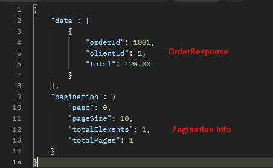

### Why generics <T>?

When we use generics, we allow that this record (ApiResponse) to be reusable by different types of data without the 
need to create another Record.

It could be, for example: ``ApiResponse<ProductResponse>``

### List<T>

That indicates that the list can contain elements of any kind! But the individual elements, can't be handled directly
in the record.

# Calculating the total value of all orders per client

We're not going to use Spring Data MongoRepository, we are going to use the Mongo Template.

He is useful when we want to make complex queries inside mongoDB. So, if we need to make some aggregation or grouping,
MongoTemplate is good for that.

Our method will return a BigDecimal. 

We'll create a var named ``aggregations``, ``newAggregation()``, and inside of it we write our conditional query.

```java
public BigDecimal findTotalOnOrdersByCustomerId(Long customerId) {
        var aggregations = newAggregation(
                //the key we want to compare
                match(Criteria.where("customerId").is(customerId)),

                //creating the query on MongoDB where he'll return the sum for us
                group().sum("total").as("total")

        );

        //Document is always "BSON"
        var response = mongoTemplate.aggregate(aggregations, "tb_order", Document.class);

        //To access this document
        //he is gonna try to access the "total" fied, if we cant, he's going to return zero
        return new BigDecimal(response.getUniqueMappedResult().get("total").toString());


}
```

To show this on the response, we have to make some changes on our ``ApiResponse``. Right now it's like this:

```java
public record ApiResponse<T>(List<?> data,
                             PaginationDTO pagination) {
}
```

We are going to insert another field, a Map that's going to be like a summary, check it out:

```java
public record ApiResponse<T>(Map<String, Object> summary,
                             List<?> data,
                             PaginationDTO pagination) {
}
```

Inside our Controller, we are going to insert it in our constructor.

```java
```

